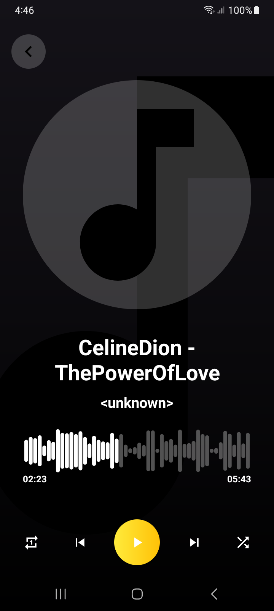
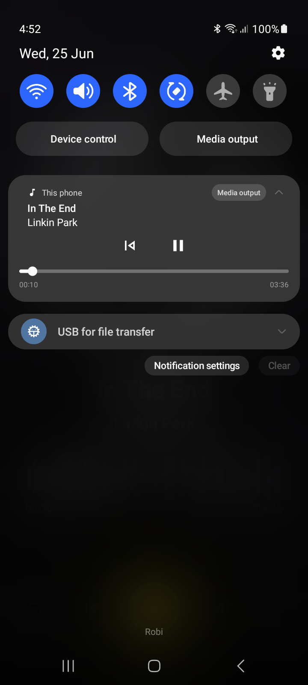

# 🎵 Android Music Player

An elegant and powerful local music player app built using **Jetpack Media3 (ExoPlayer)**. It features modern audio playback with waveform seekbar, blur effects, notification media controls, and seamless background playback using `MediaSessionService`.

---

## ✨ Features

- 🎧 Offline audio playback using **Media3 + ExoPlayer**
- 🔄 Notification media controls: **Play/Pause, Next, Previous, Shuffle, Repeat**
- 📶 **Waveform SeekBar** for interactive progress
- 🌁 Album art with **blurred background**
- 📱 Stylish and responsive **UI built with ViewBinding**
- 🔊 Background playback via **MediaSessionService**
- 🔁 Shuffle & Repeat functionality via notification

---

## 📸 UI Preview

| 🎼 Player Screen | 🔔 Notification Controls |
|------------------|---------------------------|
|  | 

---

## 🛠 Tech Stack

- ✅ **Java**
- ✅ **Media3** (`ExoPlayer`, `MediaSession`, `MediaStyleNotification`)
- ✅ **Glide** + Blur Transformation
- ✅ **Frolo Waveform Seekbar**
- ✅ **ViewBinding**
- ✅ **AndroidX**

---


---

## 🚀 Getting Started

### Prerequisites

- Android Studio **Arctic Fox or higher**
- Android SDK **24+**
- Java 11+

### 1. Clone the repository

```bash
git clone https://github.com/your-username/android-music-player.git
```
### 2. Open in Android Studio
       	Open the project folder
	Sync Gradle
	Grant storage/audio permissions (if needed)

### 3. Build & Run
	Run the app on your physical device/emulator
	Add .mp3 or .m4a files to your device storage
	Start enjoying your music 🎶
	

## 🧪 Tested On
✅ Android 10 (API 29)
✅ Android 11, 12, 13, and 14
✅ .mp3, .m4a audio files
✅ Works in background and lock screen

## 📜 License
This project is licensed under the MIT License. See the LICENSE file for details.

## 👤 Author

**Md. Shahadot Hossain**  
App Developer @ HawkEyes Digital Monitoring Ltd  
📍 Dhaka, Bangladesh  
🌐 [LinkedIn](https://www.linkedin.com/in/shahadot786/)


